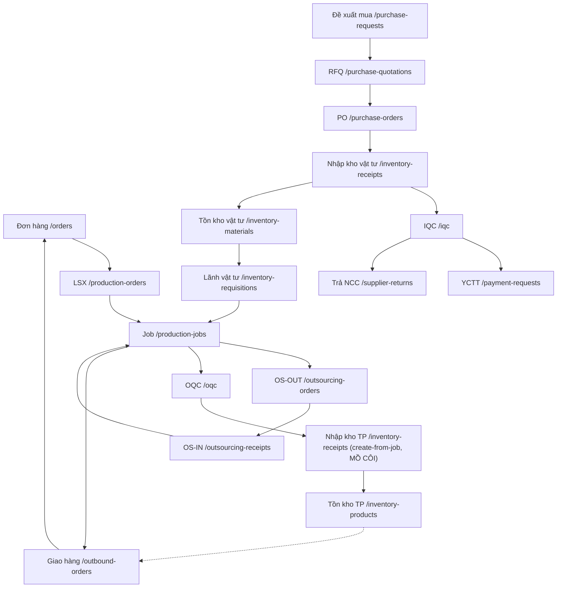

# Sơ đồ luồng UI — Web QLSX

## Purpose

Tài liệu này map **màn hình ↔ nút bấm ↔ route ↔ trạng thái** cho toàn bộ app, để rà soát luồng
nghiệp vụ có bị đứt/thiếu ở tầng giao diện hay không.

Nó **không thay**:

- Swagger (`:8000/api-docs`) — không liệt kê endpoint/DTO.
- `be-quanlysanxuat/docs/domains/*.md` — không lặp lại business rule/invariant; chỉ trỏ link.
- `be-quanlysanxuat/docs/workflows/*.md` — không lặp lại transaction boundary/side effect phía
  service; chỉ lấy đủ thông tin trigger/state để vẽ màn hình theo đúng thứ tự.

Phạm vi: 3 chuỗi nghiệp vụ chính (Bán hàng, Mua vật tư, Sản xuất) xuyên tới lúc giao hàng. Các màn
danh mục/hệ thống (khách hàng, NCC, sản phẩm, vật tư, đơn vị tính, công đoạn, nhân sự, phân quyền)
chỉ liệt kê ở Screen map, không có Flow riêng.

## How to read

- Node trong sơ đồ Mermaid = **màn hình**, ghi kèm route trong backtick.
- Cạnh = **nút bấm** (nhãn nút thật, lấy từ code — không tự đặt tên) hoặc "tự động" khi backend tự
  chuyển trạng thái không cần người bấm gì thêm.
- `[TỰ ĐỘNG]` trên cạnh = backend tự sinh/tự chuyển, không có thao tác UI tương ứng.
- `[MỒ CÔI]` trên node = route tồn tại nhưng không có `<Link>`/`navigate` nào trỏ tới — chỉ vào
  được bằng gõ URL tay.
- Bảng trạng thái dùng đúng nhãn trong `src/lib/types/*.type.ts` (`*StatusLabels`), không diễn giải
  lại.

## Screen map

9 nhóm sidebar (`AppSidebar.tsx`), 23 mục menu, 73 màn hình. "Lối vào" chỉ ghi cho màn con
(detail/create/update) — màn gốc của mỗi mục menu luôn vào từ sidebar.

| Nhóm             | Mục menu (route)                                  | Màn con                                                            | Lối vào màn con                                                                                                                                     |
| ---------------- | ------------------------------------------------- | ------------------------------------------------------------------ | --------------------------------------------------------------------------------------------------------------------------------------------------- |
| Tổng quan        | Bảng điều khiển `/manage`                         | —                                                                  | —                                                                                                                                                   |
| Quản lý bán hàng | Đơn hàng (SO) `/manage/orders`                    | `create`, `$orderId`, `$orderId/update`                            | nút "Tạo đơn hàng"; click dòng bảng; nút sửa trên chi tiết (chỉ khi còn sửa được)                                                                   |
|                  | Giao hàng (DO) `/manage/outbound-orders`          | `create`, `$outboundOrderId`                                       | nút "Tạo phiếu giao hàng"; click dòng bảng. **Không có route update riêng** — sửa inline bằng `?mode=edit` trên trang chi tiết                      |
| Quản lý mua hàng | Đề xuất mua hàng `/manage/purchase-requests`      | `create`, `$purchaseRequestId`                                     | nút "Tạo đề xuất"; click dòng bảng                                                                                                                  |
|                  | Báo giá NCC (RFQ) `/manage/purchase-quotations`   | `create`, `$purchaseQuotationId`                                   | nút "Tạo RFQ"; click dòng bảng                                                                                                                      |
|                  | Danh mục mua hàng `/manage/purchase-ledger`       | —                                                                  | list-only, không có detail/create                                                                                                                   |
|                  | Đơn mua hàng (PO) `/manage/purchase-orders`       | `create`, `$purchaseOrderId`                                       | nút "Tạo PO thủ công" **hoặc** tự sinh `DRAFT` khi duyệt RFQ; click dòng bảng                                                                       |
|                  | Yêu cầu thanh toán `/manage/payment-requests`     | `$paymentRequestId`                                                | **không có route create** — `[TỰ ĐỘNG]` sinh khi phiếu nhập kho gắn PO POSTED đủ hàng lần đầu                                                       |
|                  | Trả NCC `/manage/supplier-returns`                | `$supplierReturnId`                                                | **không có route create** — sinh từ hành động "Kho xuất trả NCC" trên phiếu IQC FAIL                                                                |
| QC               | IQC `/manage/iqc`                                 | `$iqcId`                                                           | **không có route create** — `[TỰ ĐỘNG]` sinh khi phiếu nhập kho chọn "Xác nhận & Gửi IQC"                                                           |
|                  | OQC `/manage/oqc`                                 | `$oqcId`                                                           | **không có route create** — sinh khi Job bấm "Yêu cầu OQC"                                                                                          |
| Quản lý sản xuất | Lệnh sản xuất (LSX) `/manage/production-orders`   | `$productionOrderId`                                               | **không có route create** — `[TỰ ĐỘNG]` sinh (`PENDING`) khi đơn hàng được duyệt                                                                    |
|                  | Quản lý sản xuất (Job) `/manage/production-jobs`  | `$productionJobId` (tab `info`\|`bom`\|`operations`)               | **không có route create** — `[TỰ ĐỘNG]` sinh khi duyệt LSX                                                                                          |
|                  | Thực hiện sản xuất `/manage/production-execution` | `$productionJobId`                                                 | click dòng bảng (chỉ Job đang `IN_PROGRESS`)                                                                                                        |
|                  | Lãnh vật tư `/manage/inventory-requisitions`      | `create`, `$requisitionId`                                         | nút "Tạo phiếu lãnh vật tư" (wizard, tự chọn Job ngay trong form — không deep-link từ Job); click dòng bảng                                         |
| Gia công ngoài   | Xuất đi gia công `/manage/outsourcing-orders`     | `create`, `$outsourcingOrderId`                                    | nút "Gửi đi gia công ngoài" **trên tab Công đoạn của Job** (deep-link, lọc sẵn công đoạn `OUTSOURCE`) **hoặc** nút "Tạo" trên list; click dòng bảng |
|                  | Nhập về (OS-IN) `/manage/outsourcing-receipts`    | `create`, `$outsourcingReceiptId`                                  | nút "Tạo" trên list (picker chọn OS-OUT đang `SENT`/`PARTIAL`); click dòng bảng                                                                     |
| Quản lý kho      | Nhập kho `/manage/inventory-receipts`             | `create`, `create-receipt`, `create-from-job`, `$id`, `$id/update` | xem **F1** — `create-from-job` **`[MỒ CÔI]`**                                                                                                       |
|                  | Xuất kho `/manage/inventory-issues`               | —                                                                  | list-only — **không có route chi tiết** (F6)                                                                                                        |
|                  | Tồn kho vật tư `/manage/inventory-materials`      | —                                                                  | list-only                                                                                                                                           |
|                  | Tồn kho thành phẩm `/manage/inventory-products`   | `$itemId`                                                          | click dòng bảng                                                                                                                                     |
| Danh mục         | Khách hàng `/manage/clients`                      | `create`, `$clientId/update`                                       | **không có route chi tiết** (F7), khác `suppliers`                                                                                                  |
|                  | Nhà cung cấp `/manage/suppliers`                  | `create`, `$supplierId`, `$supplierId/update`                      |                                                                                                                                                     |
|                  | Sản phẩm `/manage/products`                       | `create`, `$productId` (tab `info`\|`boms`\|`materials`)           | **không có route update** — sửa ngay trên tab `info`                                                                                                |
|                  | Vật tư `/manage/materials`                        | `create`, `$materialId/update`                                     |                                                                                                                                                     |
|                  | Đơn vị tính `/manage/units`                       | —                                                                  | tạo/sửa bằng dialog, không phải route                                                                                                               |
|                  | Công đoạn `/manage/operations`                    | —                                                                  | tạo/sửa bằng dialog, không phải route                                                                                                               |
| Hệ thống         | Nhân sự `/manage/users`                           | `create`, `$userId/update`                                         |                                                                                                                                                     |
|                  | Phân quyền `/manage/roles`                        | `create`, `$roleId/update`                                         | **dev-only** (`devOnlyRoutes`) — vẫn hiện trên sidebar ở production (F4)                                                                            |

---

## Flow 1 — Bán hàng (SO → LSX → Job → DO)

```mermaid
flowchart LR
    A["Đơn hàng /manage/orders"] -->|"Tạo đơn hàng"| B["Tạo đơn hàng /manage/orders/create"]
    B -->|lưu| C["Chi tiết đơn /manage/orders/$orderId"]
    C -->|"Gửi duyệt"| C
    C -->|"Duyệt"| D["LSX /manage/production-orders (TỰ ĐỘNG sinh PENDING)"]
    D -->|"Duyệt LSX"| E["Job /manage/production-jobs (TỰ ĐỘNG sinh)"]
    E -.->|xem Flow 3| F["... chạy sản xuất ..."]
    F -.-> G["Job COMPLETED"]
    G --> H["Giao hàng /manage/outbound-orders/create (chọn dòng đơn chưa giao đủ)"]
    H -->|"Gửi duyệt"| I["Chi tiết DO /manage/outbound-orders/$id"]
    I -->|"Duyệt"| I
    I -->|"Giao hàng"| I
    I -->|TỰ ĐỘNG, giao đủ| J["Đơn hàng COMPLETED"]
```



| #   | Màn hình           | Hành động                           | Route đích                       | Trạng thái                                                                  |
| --- | ------------------ | ----------------------------------- | -------------------------------- | --------------------------------------------------------------------------- |
| 1   | Danh sách đơn hàng | "Tạo đơn hàng"                      | `/manage/orders/create`          | — → `DRAFT`                                                                 |
| 2   | Tạo đơn hàng       | lưu                                 | `/manage/orders/$orderId`        | tạo `DRAFT`                                                                 |
| 3   | Chi tiết đơn hàng  | "Gửi duyệt"                         | (ở lại)                          | `DRAFT` → `PENDING_CONFIRMATION`                                            |
| 4   | Chi tiết đơn hàng  | "Duyệt" / "Từ chối"                 | (ở lại)                          | `PENDING_CONFIRMATION` → `AWAITING_PRODUCTION` / `REJECTED`                 |
| 5   | _(tự động)_        | duyệt đơn seed kế hoạch LSX         | `/manage/production-orders`      | LSX mới: `PENDING`                                                          |
| 6   | Chi tiết LSX       | "Duyệt LSX" / "Hủy LSX"             | (ở lại)                          | `PENDING` → `APPROVED` (tự sinh Job `PENDING`)                              |
| 7   | _(xem Flow 3)_     | Job chạy hết vòng đời               | —                                | Job → `COMPLETED`; mọi Job `COMPLETED` → LSX `COMPLETED` (tự động, cascade) |
| 8   | Danh sách DO       | "Tạo phiếu giao hàng"               | `/manage/outbound-orders/create` | tạo `DRAFT` (chọn dòng đơn hàng chưa giao đủ)                               |
| 9   | Chi tiết DO        | "Gửi duyệt" → "Duyệt" → "Giao hàng" | (ở lại)                          | `DRAFT` → `PENDING_APPROVAL` → `PENDING_DELIVERY` → `DELIVERED`             |
| 10  | _(tự động)_        | DO giao đủ SL đơn hàng              | —                                | Đơn hàng `AWAITING_PRODUCTION`/`IN_PROGRESS` → `COMPLETED`                  |

**Ghi chú đứt gãy:** bước 8 không deep-link từ chi tiết đơn hàng (không có nút "Giao hàng" trên
`OrderDetailPage`) — người dùng phải tự vào `/manage/outbound-orders` rồi tự chọn đúng dòng đơn
trong picker. Chưa xác nhận bằng test xem picker có dễ tìm đúng đơn không (xem Test log).

---

## Flow 2 — Mua vật tư (PR → RFQ → PO → Nhập kho → IQC → Thanh toán)

```mermaid
flowchart LR
    A["Đề xuất mua hàng /manage/purchase-requests"] -->|"Tạo đề xuất"| B["Tạo PR /create"]
    B --> C["Chi tiết PR $purchaseRequestId"]
    C -->|"Gửi duyệt"| C
    C -->|"Duyệt / Từ chối"| C
    C -.->|dùng làm nguồn| D["Tạo RFQ /manage/purchase-quotations/create"]
    D --> E["Chi tiết RFQ $purchaseQuotationId"]
    E -->|"Gửi duyệt"| E
    E -->|"Duyệt & tạo đơn mua"| F["PO mới, TỰ ĐỘNG DRAFT"]
    F --> G["Chi tiết PO $purchaseOrderId"]
    G -->|"Xác nhận đặt hàng"| G
    G -.->|"Nhập kho từ PO"| H["Tạo phiếu nhập /create-receipt?lane=po"]
    H -->|"Xác nhận & Gửi IQC"| I["Chi tiết phiếu nhập"]
    I -.->|TỰ ĐỘNG| J["IQC /manage/iqc/$iqcId"]
    J -->|"PASS → Hoàn thành"| K["Phiếu nhập POSTED, tồn kho +"]
    J -->|"Kho xuất trả NCC → Hoàn thành"| L["Trả NCC /manage/supplier-returns"]
    K -.->|TỰ ĐỘNG, đủ hàng lần đầu| M["Yêu cầu thanh toán /manage/payment-requests"]
```



| #   | Màn hình                | Hành động                                                             | Route đích                                          | Trạng thái                                                                      |
| --- | ----------------------- | --------------------------------------------------------------------- | --------------------------------------------------- | ------------------------------------------------------------------------------- |
| 1   | Danh sách PR            | "Tạo đề xuất"                                                         | `/manage/purchase-requests/create`                  | tạo `DRAFT`                                                                     |
| 2   | Chi tiết PR             | "Gửi duyệt" → "Duyệt"/"Từ chối"                                       | (ở lại)                                             | `DRAFT` → `PENDING_APPROVAL` → `APPROVED`/`REJECTED`                            |
| 3   | Danh sách RFQ           | "Tạo RFQ"                                                             | `/manage/purchase-quotations/create`                | tạo `DRAFT` (chọn PR đã duyệt làm nguồn)                                        |
| 4   | Chi tiết RFQ            | "Gửi duyệt" → "Duyệt & tạo đơn mua" / "Từ chối"                       | (ở lại)                                             | `DRAFT` → `PENDING_APPROVAL` → `APPROVED` (tự sinh PO `DRAFT`) / `CANCELLED`    |
| 5   | Chi tiết PO             | "Xác nhận đặt hàng"                                                   | (ở lại)                                             | `DRAFT` → `ORDERED`                                                             |
| 6   | Chi tiết PO             | "Nhập kho từ PO"                                                      | `/manage/inventory-receipts/create-receipt?lane=po` | tạo phiếu nhập `DRAFT`                                                          |
| 7   | Tạo/chi tiết phiếu nhập | "Xác nhận & Gửi IQC" _(hoặc_ "Xác nhận & Nhập kho (Không qua IQC)"_)_ | (ở lại)                                             | `DRAFT` → `PENDING_IQC` (tự sinh IQC `DRAFT`) _hoặc_ thẳng `POSTED`             |
| 8   | Chi tiết IQC            | "PASS → Hoàn thành"                                                   | (ở lại)                                             | IQC `DRAFT`/`PENDING` → `COMPLETED`; phiếu nhập → `POSTED`, tồn kho vật tư tăng |
| 8b  | Chi tiết IQC            | "Kho xuất trả NCC → Hoàn thành" (khi FAIL)                            | `/manage/supplier-returns` (tự sinh)                | IQC → `COMPLETED`; sinh phiếu trả NCC                                           |
| 9   | _(tự động)_             | phiếu nhập POSTED đủ SL PO lần đầu                                    | `/manage/payment-requests`                          | sinh 1 dòng `PENDING`                                                           |

**Ghi chú đứt gãy:** chưa xác nhận bằng test nút "Nhập kho từ PO" có nằm đúng trên `PurchaseOrderDetailPage`
hay chỉ có trên danh sách nhập kho (lane `po` không tự mang theo `purchaseOrderId` nếu vào từ
sidebar) — xem Test log pha 2.

---

## Flow 3 — Sản xuất (Job → Lãnh vật tư → Công đoạn → Gia công ngoài → OQC → Nhập kho TP)

```mermaid
flowchart LR
    A["Job PENDING (từ Flow 1)"] -->|"Bắt đầu SX"| B["Job IN_PROGRESS"]
    B -.->|deep-link, ngoài phạm vi form Job| C["Tạo phiếu lãnh vật tư /manage/inventory-requisitions/create"]
    C -->|"Gửi duyệt" → "Duyệt" → "Xuất kho"| D["Vật tư đã xuất cho Job"]
    B --> E["Tab Công đoạn của Job"]
    E -->|"Duyệt công đoạn" (INHOUSE)| E
    E -->|"Gửi đi gia công ngoài" (OUTSOURCE, vd SON_TINH_DIEN)| F["Tạo OS-OUT /manage/outsourcing-orders/create"]
    F -->|"Gửi gia công ngoài"| G["OS-OUT SENT"]
    G -.->|"Tạo" trên list OS-IN| H["Tạo phiếu nhận /manage/outsourcing-receipts/create"]
    H -->|"Xác nhận"| I["OS-OUT PARTIAL/WAITING_QC, công đoạn cập nhật ngược"]
    E -.->|hết công đoạn FG| J["Job WAITING_QC (TỰ ĐỘNG)"]
    J -->|"Yêu cầu OQC"| K["OQC /manage/oqc/$oqcId (TỰ ĐỘNG sinh)"]
    K -->|"Xác nhận kết quả: PASS"| L["Job WAITING_DELIVERY (TỰ ĐỘNG)"]
    L -.->|"[MỒ CÔI] gõ URL tay"| M["/manage/inventory-receipts/create-from-job"]
    M -->|"Xác nhận"| N["Phiếu nhập TP POSTED"]
    N -.->|đủ SL Job, TỰ ĐỘNG| O["Job COMPLETED"]
```

| #   | Màn hình              | Hành động                                           | Route đích                                              | Trạng thái                                                                   |
| --- | --------------------- | --------------------------------------------------- | ------------------------------------------------------- | ---------------------------------------------------------------------------- |
| 1   | Chi tiết Job          | "Bắt đầu SX"                                        | (ở lại)                                                 | `PENDING` → `IN_PROGRESS`                                                    |
| 2   | Danh sách lãnh vật tư | "Tạo phiếu lãnh vật tư" (wizard, tự chọn Job)       | `/manage/inventory-requisitions/create`                 | tạo `DRAFT`                                                                  |
| 3   | Chi tiết phiếu lãnh   | "Gửi duyệt" → "Duyệt" → "Xuất kho"                  | (ở lại)                                                 | `DRAFT` → `PENDING_APPROVAL` → `APPROVED` → `ISSUED`                         |
| 4   | Tab Công đoạn (Job)   | "Duyệt công đoạn" (INHOUSE)                         | (ở lại)                                                 | `NOT_STARTED`/`IN_PROGRESS` → `DONE`                                         |
| 5   | Tab Công đoạn (Job)   | "Gửi đi gia công ngoài" (OUTSOURCE)                 | `/manage/outsourcing-orders/create` (lọc sẵn công đoạn) | tạo OS-OUT                                                                   |
| 6   | Tạo/chi tiết OS-OUT   | "Xác nhận & tạo phiếu" → "Gửi gia công ngoài"       | (ở lại)                                                 | tạo → `SENT`                                                                 |
| 7   | Danh sách OS-IN       | "Tạo" (picker OS-OUT `SENT`/`PARTIAL`) → "Xác nhận" | `/manage/outsourcing-receipts/create`                   | OS-OUT `SENT` → `PARTIAL`/`WAITING_QC`; công đoạn tương ứng cập nhật tiến độ |
| 8   | _(tự động)_           | không còn công đoạn nào của node FG dở              | —                                                       | Job `IN_PROGRESS` → `WAITING_QC`                                             |
| 9   | Chi tiết Job          | "Yêu cầu OQC"                                       | `/manage/oqc/$oqcId` (tự sinh)                          | sinh OQC `DRAFT`                                                             |
| 10  | Chi tiết OQC          | "Xác nhận kết quả" (PASS)                           | (ở lại)                                                 | OQC → `COMPLETED`; Job `WAITING_QC` → `WAITING_DELIVERY` (khi đủ coverage)   |
| 11  | _(gõ URL tay — F1)_   | vào `/manage/inventory-receipts/create-from-job`    | —                                                       | —                                                                            |
| 12  | Tạo phiếu nhập TP     | "Xác nhận"                                          | (ở lại)                                                 | phiếu nhập → `POSTED`, tồn kho TP tăng                                       |
| 13  | _(tự động)_           | nhập đủ `job.quantity`                              | —                                                       | Job `WAITING_DELIVERY` → `COMPLETED`                                         |

**Ghi chú đứt gãy:** bước 11 là điểm đứt duy nhất đã xác nhận bằng phân tích tĩnh trước khi test —
xem **F1**/**F2**.

---

## Flow 4 — Chuỗi tổng (mức màn hình)



---

## Entry points

Toàn bộ cạnh điều hướng **xuyên domain** (đã grep `to="..."`/`to: "..."` toàn repo, lọc bỏ cạnh nội
bộ trong cùng feature):

| Từ màn hình (feature)             | Nút/link          | Tới route                                                                                                                                                                                                                                                                                                           |
| --------------------------------- | ----------------- | ------------------------------------------------------------------------------------------------------------------------------------------------------------------------------------------------------------------------------------------------------------------------------------------------------------------- |
| `inventory-products` (chi tiết)   | log/lịch sử       | `/manage/inventory-receipts/$id`, `/manage/oqc/$id`, `/manage/orders/$id`, `/manage/outbound-orders/$id`, `/manage/production-jobs/$id`                                                                                                                                                                             |
| `iqc` (chi tiết)                  | nguồn/kết quả     | `/manage/inventory-receipts/$id`, `/manage/materials/$id/update`, `/manage/purchase-orders/$id`, `/manage/supplier-returns/$id`                                                                                                                                                                                     |
| `manage` (dashboard)              | "Xem tất cả →"    | `/manage/inventory-receipts/create`, `/manage/iqc`, `/manage/oqc`, `/manage/outbound-orders`(+`create`), `/manage/outsourcing-orders`, `/manage/outsourcing-receipts/create`, `/manage/production-jobs`, `/manage/purchase-orders/create`, `/manage/purchase-quotations/create`, `/manage/purchase-requests/create` |
| `oqc` (chi tiết)                  | nguồn             | `/manage/production-jobs/$id`, `/manage/products/$id`                                                                                                                                                                                                                                                               |
| `orders` (chi tiết)               | dòng sản phẩm     | `/manage/products/$id`                                                                                                                                                                                                                                                                                              |
| `outbound-orders` (chi tiết)      | nguồn             | `/manage/orders/$id`, `/manage/production-jobs/$id`                                                                                                                                                                                                                                                                 |
| `outsourcing-receipts` (chi tiết) | nguồn             | `/manage/outsourcing-orders/$id`                                                                                                                                                                                                                                                                                    |
| `payment-requests` (chi tiết)     | nguồn             | `/manage/purchase-orders/$id`                                                                                                                                                                                                                                                                                       |
| `production-jobs` (chi tiết/tab)  | nguồn + hành động | `/manage/orders/$id`, `/manage/outsourcing-orders/create` **(entry point duy nhất tạo OS-OUT có deep-link)**, `/manage/production-orders/$id`, `/manage/products/$id`                                                                                                                                               |
| `production-orders` (chi tiết)    | nguồn             | `/manage/orders/$id`                                                                                                                                                                                                                                                                                                |
| `purchase-orders` (chi tiết)      | nguồn             | `/manage/purchase-quotations/$id`, `/manage/purchase-requests/$id`                                                                                                                                                                                                                                                  |
| `purchase-quotations` (chi tiết)  | kết quả           | `/manage/purchase-orders/$id`                                                                                                                                                                                                                                                                                       |
| `purchase-requests` (chi tiết)    | tham chiếu        | `/manage/inventory-materials`, `/manage/production-orders/$id`                                                                                                                                                                                                                                                      |

**Không tìm thấy cạnh nào** đi tới `/manage/inventory-receipts/create-from-job` — khớp F1.
**Không tìm thấy cạnh nào** từ `orders`/`outbound-orders` sang nhau theo hướng tạo DO — khớp ghi
chú đứt gãy ở Flow 1 bước 8.

---

## Findings

| ID  | Mức độ         | Phát hiện                                                                                                                                                                                                                                                                                                                                                                                                                                                                                         | Xác nhận bằng test?                                                                                                                                                                                                                                                                                                                                                       |
| --- | -------------- | ------------------------------------------------------------------------------------------------------------------------------------------------------------------------------------------------------------------------------------------------------------------------------------------------------------------------------------------------------------------------------------------------------------------------------------------------------------------------------------------------- | ------------------------------------------------------------------------------------------------------------------------------------------------------------------------------------------------------------------------------------------------------------------------------------------------------------------------------------------------------------------------- |
| F1  | **Chặn luồng** | `/manage/inventory-receipts/create-from-job` mồ côi — không route/nút nào trong UI dẫn tới, đây là route duy nhất trong 71 route rơi vào tình trạng này. Người dùng thường (không gõ URL) không có cách nào tạo phiếu nhập kho thành phẩm → Job không bao giờ tự đóng `COMPLETED` qua UI.                                                                                                                                                                                                         | ✅ **Xác nhận**. Kiểm tra header Job (`JOB0002`) ở cả trạng thái `Đang SX` lẫn `Chờ giao hàng` (`WAITING_DELIVERY`, đúng lúc màn nhập TP hữu ích nhất) — không có nút "Nhập kho thành phẩm" ở bất kỳ trạng thái nào. Route vẫn hoạt động đúng khi gõ URL trực tiếp kèm `?productionJobId=...`: tự điền đúng Job + dòng thành phẩm SL kế hoạch.                            |
| F2  | Rác tài liệu   | 2 comment mâu thuẫn về lối vào màn nhập TP: `InventoryReceiptCreateFromJobForm.tsx:24-27` (nói có nút trên header Job) vs `ProductionJobDetailHeader.tsx:33-35` (nói cố ý không có, vì nhập kho tạo từ module Inventory Receipts). Thực tế module Inventory Receipts cũng không link tới. Nên sửa 1 trong 2 comment cho khớp thực tế, hoặc bổ sung entry point thật (khuyến nghị: thêm nút trên header Job khi `WAITING_DELIVERY`, theo đúng ý định ban đầu của `ProductionJobDetailHeader.tsx`). | ✅ **Xác nhận** — cả 2 tuyên bố trong comment đều sai so với UI thật (xem F1).                                                                                                                                                                                                                                                                                            |
| F3  | Rác code       | `src/features/inventory-adjustments/` chết hoàn toàn: `pages/`/`components/*` rỗng, không `api/`, không ai import. Kèm 4 thư mục route rỗng (`inventory-adjustments/`, `inventory-adjustments_/`, `operations_/`, `units_/`) không sinh route nào (Vite router bỏ qua thư mục rỗng). `src/lib/types/inventory-adjustment.type.ts` vẫn còn dùng ở đâu đó cần kiểm lại hoặc xoá theo.                                                                                                               | N/A (đọc code) — ngoài phạm vi 3 chuỗi test.                                                                                                                                                                                                                                                                                                                              |
| F4  | UI nhỏ         | `AppSidebar.tsx` render đủ 23 mục không lọc quyền/`isRouteAvailable`, trong khi comment ở `route-permissions.ts` khẳng định sidebar có lọc. "Phân quyền" (dev-only) vẫn hiện ở sidebar production trước khi bị guard đá về `/manage` khi click.                                                                                                                                                                                                                                                   | ☐ chưa — ngoài phạm vi 3 chuỗi test (màn hệ thống).                                                                                                                                                                                                                                                                                                                       |
| F5  | UI nhỏ         | Sidebar active-state so khớp tuyệt đối `pathname === href` — mọi màn con (detail/create/update) không làm sáng mục cha, người dùng mất định hướng "đang ở nhóm nào".                                                                                                                                                                                                                                                                                                                              | N/A (đọc code) — quan sát được gián tiếp xuyên suốt test (không mục sidebar nào từng sáng khi ở trang chi tiết) nhưng không phải trọng tâm test.                                                                                                                                                                                                                          |
| F6  | Thiếu luồng    | `/manage/inventory-issues` chỉ có danh sách, không có route chi tiết — trong khi phiếu xuất kho là kết quả của cả "Xuất kho" (lãnh vật tư) và "Giao hàng" (DO). Không tra ngược được chứng từ xuất kho từ chính module Xuất kho.                                                                                                                                                                                                                                                                  | ✅ **Xác nhận**. Test tự sinh đủ 4 phiếu xuất kho (`PXK-2026-00001`/`00002` loại "Sản xuất" từ 2 phiếu lãnh vật tư của LSX0001/LSX0002; `PXK-2026-00003`/`00004` loại "Bán hàng" từ 2 DO giao hàng) — cả 4 dòng trong danh sách chỉ có nút "In phiếu" (disabled) và "Hủy phiếu", không có "Xem chi tiết" nào.                                                             |
| F7  | Bất nhất       | `/manage/clients` không có route chi tiết (chỉ list/create/update), trong khi `/manage/suppliers` — cùng vai trò danh mục đối tác — có đủ 4 route kể cả `$supplierId`.                                                                                                                                                                                                                                                                                                                            | N/A (đọc code) — ngoài phạm vi 3 chuỗi test.                                                                                                                                                                                                                                                                                                                              |
| F8  | Dữ liệu giả    | Tab "Thông tin chung" của Job hiển thị bảng "LỊCH SỬ THAY ĐỔI" gắn nhãn "Dữ liệu mẫu" — hardcode 3 dòng cố định (diễn viên "Nguyễn Văn A"/"Trần Thị B", mốc thời gian tháng 7/2026) không liên quan gì tới Job đang xem.                                                                                                                                                                                                                                                                          | ✅ **Xác nhận**. Xem `JOB0002` sau khi tự tay thực hiện "Xác nhận", báo cáo 5 công đoạn, "Yêu cầu OQC" — bảng lịch sử vẫn hiện nguyên 3 dòng mẫu cũ, không ghi nhận bất kỳ hành động thật nào vừa làm.                                                                                                                                                                    |
| F9  | Dữ liệu giả    | Trang chi tiết đơn hàng (SO) có khối "Lịch sử giao hàng" cũng gắn nhãn "Dữ liệu mẫu" — cùng kiểu hardcode như F8 nhưng ở màn khác, hiện mã DO giả (`SOxxxx-DO01`/`DO02`) và SL/giá trị/phương tiện không khớp DO thật.                                                                                                                                                                                                                                                                            | ✅ **Xác nhận**. `SO0001` sau khi giao đủ 20 bằng `DO-260831-001` thật vẫn hiện "SO0001-DO01"/"SO0001-DO02" (SL 10+10, biển số xe khác); `SO0002` sau khi giao đủ 20 bằng `DO-260831-002` thật cũng hiện y hệt kiểu "SO0002-DO01"/"DO02" giả.                                                                                                                             |
| F10 | UI nhỏ         | Ghi chú hướng dẫn trên tab "Công đoạn sản xuất" của Job ghi "Gõ số vào ô SL hoàn thành... rồi bấm nút Lưu (hoặc Enter) để lưu ngay dòng đó" — sai một nửa: Enter một mình không làm gì cả.                                                                                                                                                                                                                                                                                                        | ✅ **Xác nhận**. `NumericCellInput` chỉ đẩy giá trị vào TanStack Form khi blur (Tab/click ra ngoài), không đẩy theo từng phím gõ; nút "Lưu" chỉ mount sau blur (trong `form.Subscribe selector={state => state.isDirty}`) nên trước đó không có nút submit mặc định nào để Enter kích hoạt. Gõ xong bấm Enter ngay (chưa blur) không lưu được gì, không có toast báo lỗi. |
| F11 | UI nhỏ         | Picker chọn OS-OUT khi tạo phiếu nhận (OS-IN) không lọc bỏ OS-OUT đã nhận đủ 100% — vẫn cho chọn lại phiếu đã "Hoàn thành"/0 còn lại.                                                                                                                                                                                                                                                                                                                                                             | ✅ **Xác nhận** — quan sát trong Phase 4: `OS-OUT-0001` (đã "Hoàn thành", CÒN LẠI = 0) vẫn xuất hiện chọn được trong picker tạo OS-IN mới.                                                                                                                                                                                                                                |
| F12 | Hiển thị sai   | Danh sách và chi tiết OS-IN luôn hiện "--" ở cột "VẬT TƯ" và "MÃ OS-OUT", kể cả với phiếu vừa tạo xong trong phiên test.                                                                                                                                                                                                                                                                                                                                                                          | ✅ **Xác nhận** — tái hiện trên cả OS-IN cũ (seed) lẫn `OS-IN-0002` mới tạo trong Phase 4 của phiên test này.                                                                                                                                                                                                                                                             |
| F13 | Tính sai       | Trang "Tồn kho thành phẩm" cột "TỒN TP KHẢ DỤNG" (công thức ghi chú: `Tồn thực tế - Đã giữ - BOM`) trả về thấp hơn đáng kể so với `Tồn thực tế - Đã giữ` — có vẻ đang trừ thêm một khoản "nhu cầu BOM" không nên áp dụng cho thành phẩm bán thẳng.                                                                                                                                                                                                                                                | ✅ **Xác nhận**. `SP0001` sau khi `PNK-2026-00004` (20 TP từ JOB0002) POSTED: Tồn thực tế = 40, Đã giữ = 20 (do `DO-260831-001` đang Nháp giữ chỗ) → khả dụng đúng ra phải là 20, nhưng cột hiện **0**.                                                                                                                                                                   |
| F14 | UI nhỏ         | Chú thích trạng thái ("CHÚ THÍCH TRẠNG THÁI") ở cuối trang danh sách PO có 1 dòng tiếng Anh "Draft" trong khi 4 dòng còn lại đều tiếng Việt ("Đã đặt hàng", "Đang nhận hàng", "Hoàn tất", "Đã hủy") — vi phạm quy ước "UI text tiếng Việt" của dự án.                                                                                                                                                                                                                                             | ✅ **Xác nhận** — `/manage/purchase-orders`, khối chú thích trạng thái cuối trang.                                                                                                                                                                                                                                                                                        |
| F15 | Chưa rõ        | Ghi nhận nhanh trong Phase 2 (trước khi ngữ cảnh phiên làm việc bị nén): wizard tạo RFQ từng hiện thêm dòng vật tư "phantom" ngoài ý muốn khi thao tác. Không kịp ghi lại bước tái hiện chi tiết trước khi bị nén ngữ cảnh.                                                                                                                                                                                                                                                                       | ⚠️ Quan sát một lần, **chưa xác nhận lại** — cần test lại từ đầu (tạo RFQ mới) để có bước tái hiện rõ ràng.                                                                                                                                                                                                                                                               |
| F16 | Chưa rõ        | Ghi nhận nhanh trong Phase 2: một dialog trong luồng RFQ → PO hiện số lượng NCC không khớp số NCC thực tế đã chọn. Cùng lý do F15, chưa kịp ghi lại bước tái hiện chi tiết.                                                                                                                                                                                                                                                                                                                       | ⚠️ Quan sát một lần, **chưa xác nhận lại** — cần test lại để xác định đúng dialog/điều kiện kích hoạt.                                                                                                                                                                                                                                                                    |

---

## Test log

Chạy bằng Chrome DevTools MCP, đăng nhập `admin`/superadmin, ngày hệ thống `31/08/2026`. Toàn bộ
chứng từ tạo ra trong DB dev dùng chung, không dọn dẹp (theo quyết định đã chốt). Mã chứng từ dưới
đây tra ngược được trực tiếp trên UI hoặc DB.

| Pha | Kết quả                              | Chứng từ chính đã tạo/xử lý                                                                                                                                                                                                                                                                                                                                                                                                                                                                                                                                                                                                                                                                                                                                   | Ghi chú                                                                                                                                                                                                                                                                                                |
| --- | ------------------------------------ | ------------------------------------------------------------------------------------------------------------------------------------------------------------------------------------------------------------------------------------------------------------------------------------------------------------------------------------------------------------------------------------------------------------------------------------------------------------------------------------------------------------------------------------------------------------------------------------------------------------------------------------------------------------------------------------------------------------------------------------------------------------- | ------------------------------------------------------------------------------------------------------------------------------------------------------------------------------------------------------------------------------------------------------------------------------------------------------ |
| 1   | ✅ Đạt                               | `SO0002` (Công ty Cổ phần Bao bì Đông Á, `SP0001` × 20) → Gửi duyệt → Duyệt → tự sinh `LSX0002` (`PENDING`).                                                                                                                                                                                                                                                                                                                                                                                                                                                                                                                                                                                                                                                  | Auto-sinh LSX đúng như thiết kế — không chặn.                                                                                                                                                                                                                                                          |
| 2   | ✅ Đạt, có lưu ý (F15/F16)           | PR → RFQ (`RFQ-00001`) → duyệt & tạo `PO-00001`/`PO-00002` → "Xác nhận đặt hàng" → nhập kho từ PO (`PNK-2026-00001`, `PNK-2026-00003`) → "Xác nhận & Gửi IQC" → IQC PASS → phiếu `POSTED`, tồn `inventory-materials` tăng đúng.                                                                                                                                                                                                                                                                                                                                                                                                                                                                                                                               | Luồng thông suốt, không bị chặn. Ghi nhận nhanh 2 điểm lạ khi thao tác wizard (F15, F16) nhưng chưa ảnh hưởng kết quả cuối.                                                                                                                                                                            |
| 3   | ✅ Đạt, có lưu ý (F10)               | Duyệt `LSX0002` → tự sinh `JOB0002` (`PENDING`) → "Xác nhận" (`Chưa SX`→`Đang SX`) → phiếu lãnh vật tư duyệt+xuất (→ `PXK-2026-00002`) → báo cáo đủ SL cho cả 5 dòng công đoạn Trong xưởng (`SP0002`: Cắt CNC, Hàn khung; `SP0001`: Cắt CNC, Hàn khung) qua bảng inline trên tab "Công đoạn sản xuất".                                                                                                                                                                                                                                                                                                                                                                                                                                                        | Đúng như dự đoán ở kế hoạch: `SP0001` (FG) 2 dòng "Lắp ráp thành phẩm" ban đầu bị chặn `assembly_not_ready` cho tới khi Pha 4 xong (đúng luật nghiệp vụ, không phải bug). Riêng thao tác nhập liệu gặp đúng vấn đề F10 — phải gõ số rồi bấm ra ngoài (blur) mới hiện nút Lưu, Enter một mình không ăn. |
| 4   | ✅ Đạt, có lưu ý (F11/F12)           | Công đoạn `CD03` Mạ kẽm (`SP0002`, OUTSOURCE) → "Gửi gia công ngoài" → tạo & gửi `OS-OUT-0002` (`SENT`) → tạo `OS-IN-0002`, xác nhận nhận đủ 20/20 → `CD03` tự cập nhật "Hoàn thành", `SP0002` xong cả 3 công đoạn.                                                                                                                                                                                                                                                                                                                                                                                                                                                                                                                                           | Vòng gia công ngoài round-trip tự cập nhật ngược đúng thiết kế. Gặp F11 (picker OS-IN không lọc OS-OUT đã nhận đủ) và F12 (cột VẬT TƯ/MÃ OS-OUT luôn "--") nhưng không chặn luồng.                                                                                                                     |
| 5   | ✅ Đạt (xác nhận F1/F2/F6/F8/F9/F13) | Sau Pha 4, 2 dòng "Lắp ráp thành phẩm" của `SP0001` báo cáo đủ SL → Job `Chờ QC` → "Yêu cầu OQC" → tạo `OQC-2026-00002` → nhập AQL (Mức II, 2.5%, dùng gợi ý n=5, NG=0) → PASS → Job `Chờ giao hàng` → gõ URL tay `/manage/inventory-receipts/create-from-job?productionJobId=...` (xác nhận F1) → phiếu tự tạo sẵn `PNK-2026-00004` → "Xác nhận nhập kho" → `POSTED`, tồn TP `SP0001` tăng 20 (từ 20 lên 40) → Job `Hoàn thành`. Rồi tạo `DO-260831-002` (chọn dòng `SO0002`/`JOB0002`) → Gửi duyệt → Duyệt → "Xác nhận đã giao" → `Đã giao`, tự sinh `PXK-2026-00004`, trừ tồn TP → `SO0002` → `Hoàn thành` (100%). Nhân tiện xử lý luôn `DO-260831-001` (nháp có sẵn từ trước, cho `SO0001`/`JOB0001`) qua cùng chu trình → `SO0001` cũng về `Hoàn thành`. | Đóng trọn 2 đơn hàng (`SO0001` và `SO0002` — đơn của Pha 1) về `Hoàn thành`, xác nhận toàn bộ chuỗi auto-generation từ đầu tới cuối. F1 xác nhận sống: route hoạt động đúng khi gõ URL tay nhưng đúng là mồ côi trên UI (không nút nào ở header Job dẫn tới, kể cả lúc `WAITING_DELIVERY`).            |

**Không pha nào bị chặn hoàn toàn** — cả 3 chuỗi nghiệp vụ (Bán hàng, Mua vật tư, Sản xuất) đi hết
từ đầu tới cuối, kể cả nhánh gia công ngoài. Điểm nghẽn thật duy nhất (F1: phải gõ URL tay ở Pha 5)
không chặn được vì test biết trước route đích; người dùng thường sẽ kẹt cứng ở đây — đây là phát
hiện quan trọng nhất của toàn bộ đợt test.

---

## Related docs

- Trạng thái/vòng đời chi tiết từng domain: `be-quanlysanxuat/docs/domains/{orders,purchasing,
production,inventory,quality-iqc,quality-oqc,partners}.md`.
- Trình tự nghiệp vụ đầy đủ (trigger/precondition/side effect/transaction boundary):
  `be-quanlysanxuat/docs/workflows/{order-approval,production-order-approval,
production-job-execution,rfq-approval,purchase-to-payment,receipt-confirmation,
outsourcing-round-trip,outgoing-qc,inventory-requisition,outbound-delivery,
supplier-return}.md`.
- Quyết định "đóng Job tự động": `be-quanlysanxuat/docs/decisions/production-lifecycle-closing.md`.
- Quy ước tầng route/feature của repo này: `.claude/rules/architecture.md`,
  `.claude/rules/project-and-commands.md`.
